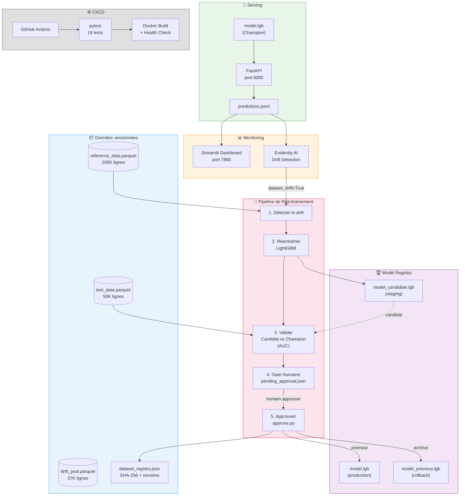

# Project 8 — Notes détaillées : MLOps pour le Credit Scoring

## Retour instructeur — Ce qui a été ajouté

Suite au retour de l'instructeur, le projet a été enrichi sur les points suivants :

- **Gros volume de données** : utilisation de l'intégralité des 307 511 lignes du dataset Home Credit, réparties en 200K (référence/entraînement), 50K (test/validation) et ~57K (pool de simulation de drift)
- **Simulation réaliste du drift** : 4 scénarios utilisant des sous-ensembles **réels** biaisés (clients jeunes, hauts revenus, gros crédits) — pas du bruit synthétique — pour simuler des changements de population en production
- **Dataset versioning** : registre (`dataset_registry.json`) traçant chaque split avec SHA-256, nombre de lignes/colonnes, date de création et source
- **Pipeline de réentraînement automatisé** (`pipeline/retrain.py`) : détection de drift → réentraînement sur données historiques + nouvelles données de production combinées → validation candidat vs champion (AUC)
- **Human-in-the-loop** (`pipeline/approve.py`) : le pipeline s'arrête à une gate humaine — un expert revoit les métriques avant de promouvoir le modèle candidat en production

---

## Ce que j'ai appris — MLOps vs DevOps

En tant que DevOps, j'ai retrouvé beaucoup de concepts familiers dans le MLOps, mais avec des différences fondamentales liées à la nature des modèles de Machine Learning.

---

## 1. Model Serving = Déploiement de microservice

| MLOps | DevOps |
|-------|--------|
| FastAPI wrapping LightGBM | Microservice derrière API Gateway |
| `/health` endpoint | Liveness / Readiness probes (K8s) |
| Docker + Compose | Identique |
| Schémas Pydantic | Validation d'entrée / contrat d'API (OpenAPI) |

**Ce qui est pareil** : on conteneurise, on expose un endpoint, on vérifie la santé.
**Ce qui est différent** : le "code" ici est un fichier binaire (model.lgb) qui ne se review pas comme du code source.

---

## 2. Drift Detection = Monitoring & Alerting

| MLOps | DevOps |
|-------|--------|
| Evidently AI surveille les distributions de features | Prometheus / Grafana surveille CPU, latence, erreurs |
| Evidently déclenche `dataset_drift` si >50% des features driftent (seuil par défaut) | Alert rules dans PagerDuty / Datadog |
| Tests statistiques (Wasserstein, Jensen-Shannon, p-value < 0.05 par feature) | Seuils métriques (p95 > 500ms) |

**La différence clé** : en DevOps, on monitore des **métriques système**. En MLOps, on monitore la **qualité des données**. Un modèle peut retourner HTTP 200 tout en donnant des prédictions fausses — l'API fonctionne mais le modèle est dégradé.

### Types de drift

- **Data drift** : les distributions des features changent (ex: afflux de clients à hauts revenus). C'est ce qu'on détecte avec Evidently.
- **Concept drift** : la relation entre features et target change (ex: même revenu mais taux de défaut différent). Plus insidieux, nécessite les labels réels de production (disponibles avec retard).

### Nos 4 scénarios simulés

| Scénario | Filtre | Drift détecté | Features impactées |
|----------|--------|---------------|-------------------|
| Contrôle (aléatoire) | Random | Non (0.0%) | — |
| Démographique | Clients < 35 ans | Non (13.5%) | DAYS_BIRTH, EXT_SOURCE_1 |
| Économique | Revenus > 300K | **Oui (50.0%)** | AMT_ANNUITY, AMT_GOODS_PRICE |
| Crédit | Montant > 1M | Non (16.3%) | AMT_CREDIT, AMT_ANNUITY |

---

## 3. Retraining Pipeline = CI/CD Pipeline

| MLOps | DevOps |
|-------|--------|
| `retrain.py` : detect → retrain → validate → gate | CI : lint → build → test → staging |
| Candidat vs Champion (AUC) | Blue/Green ou Canary deployment |
| Validation AUC sur jeu de test | Tests d'intégration / smoke tests |
| `pending_approval.json` | Approval gate dans GitHub Actions / ArgoCD |

### Stratégies de déclenchement du réentraînement

| Stratégie | Principe | Analogie DevOps |
|-----------|----------|-----------------|
| **Schedulé** | Cron quotidien/hebdomadaire | Nightly builds |
| **Seuil de drift** | Evidently `dataset_drift=True` → trigger | Alert → auto-remediation |
| **Performance** | AUC descend sous un seuil en prod | SLA breach → rollback |

---

## 4. Human Approval Gate = Manual Approval en CD

| MLOps | DevOps |
|-------|--------|
| `approve.py` après revue humaine | Manual approval dans Spinnaker / ArgoCD |
| Revue des métriques AUC | Revue des tests de staging |
| Rejet = ne pas exécuter approve | Rejet = ne pas promouvoir en prod |

**Pourquoi c'est obligatoire en credit scoring** :
- **Réglementaire** : un modèle qui refuse des crédits doit être explicable et auditable
- **Équité** : un modèle réentraîné peut introduire un biais contre un groupe démographique
- **Fausse confiance** : l'AUC peut être bonne sur le test set mais le modèle se comporte différemment en production

---

## 5. Dataset Versioning = Artifact Versioning / IaC

| MLOps | DevOps |
|-------|--------|
| `dataset_registry.json` avec SHA-256 | Docker image digests, Terraform state |
| Tracer quel dataset a entraîné quel modèle | Savoir quel commit a déployé quel artifact |
| 3 splits : reference (200K), test (50K), pool (57K) | Environnements : dev, staging, prod |

**L'objectif commun** : la **reproductibilité**. Si un modèle se dégrade, on doit pouvoir retracer exactement quelles données l'ont entraîné.

### En production vs dans ce projet

| Ce projet (démonstration) | Production réelle |
|---------------------------|-------------------|
| `dataset_registry.json` (fichier local) | **DVC** (Data Version Control) — versioning git-like, données sur S3/GCS |
| SHA-256 calculé manuellement | **DVC** calcule les hashes automatiquement |
| Version bump dans `approve.py` | **MLflow Model Registry** ou **Weights & Biases** — versions, métriques, lignage |
| Fichiers parquet sur disque | **S3/GCS/Azure Blob** — stockage distant avec versioning |

Le principe est le même — tracer quel dataset a entraîné quel modèle. La différence est **où** c'est stocké et **qui** y a accès. Un JSON local fonctionne pour une personne ; un registre distant fonctionne pour une équipe. En DevOps, c'est comme la différence entre un `.env` local et un secrets manager (Vault, AWS Secrets Manager).

---

## 6. Champion / Candidat / Previous = Deployment Slots

| MLOps | DevOps |
|-------|--------|
| `model.lgb` (champion) | Slot production |
| `model_candidate.lgb` | Slot staging |
| `model_previous.lgb` | Rollback slot |
| `approve.py` promeut candidat → champion | Promote staging → production |

**Rollback** : si le nouveau modèle pose problème, on restaure `model_previous.lgb` → même principe qu'un rollback Kubernetes ou un revert de release.

---

## 7. La différence fondamentale : MLOps ≠ DevOps

> En DevOps, le système se dégrade quand **on change le code** (bugs, régressions).
> En MLOps, le modèle se dégrade quand **le monde change** (drift) — sans toucher au code.

C'est pour ça qu'on a besoin de :
- **Monitoring continu des données**, pas seulement de l'uptime
- **Réentraînement automatisé**, pas seulement du déploiement automatisé
- **Validation humaine**, parce qu'un modèle n'est pas déterministe comme du code

---

## 8. Pour aller plus loin

### A/B Testing / Canary Release de modèles
On compare champion vs candidat **offline** sur le jeu de test. En production réelle, on ferait un **canary** : envoyer 10% du trafic au nouveau modèle, comparer les résultats, puis passer à 100%.

### Monitoring de performance en production
Le dashboard Streamlit montre les scores et la latence. En production réelle, on suivrait l'**AUC au fil du temps** — mais le ground truth (défaut de paiement) n'est connu que des mois plus tard. C'est le "feedback delay" propre au ML.

### Feature Store
On hardcode 795 features dans `features.py`. En production, on utiliserait un **Feature Store** (Feast, Tecton) pour garantir la cohérence entre entraînement et inférence — même concept que la configuration centralisée en DevOps (Consul, etcd).

---

## Architecture MLOps — Vue d'ensemble

## Résumé des résultats

### Drift Analysis
- **Contrôle** : 0/104 features driftées (0.0%) → `dataset_drift=False` (baseline confirmé)
- **Démographique** : 14/104 (13.5%) → `dataset_drift=False`
- **Économique** : 52/104 (50.0%) → **`dataset_drift=True`** → réentraînement déclenché
- **Crédit** : 17/104 (16.3%) → `dataset_drift=False`

### Retraining Pipeline
- Champion AUC : **0.7478**
- Candidat AUC : **0.7492** (entraîné sur 200K référence + 4,358 production)
- Diff : **+0.0015** (candidat légèrement meilleur)
- Décision : **Approuvé** — le modèle a appris de la nouvelle population (clients hauts revenus)

### Performance API
- Latence moyenne : **1.13 ms** par prédiction
- P99 : **1.64 ms**
- Batch 1000 : **0.133 ms/record** (20x plus efficace)
